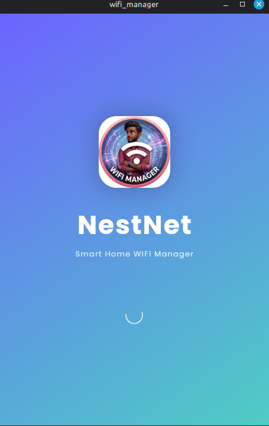
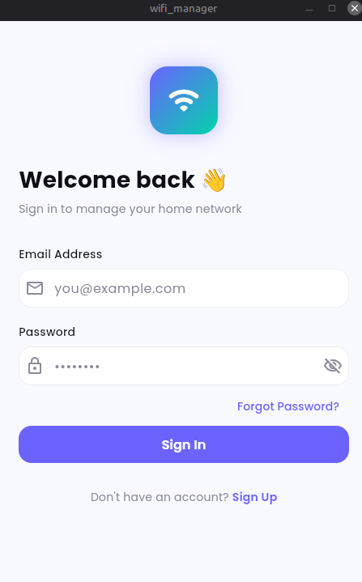
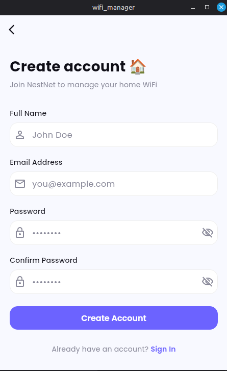
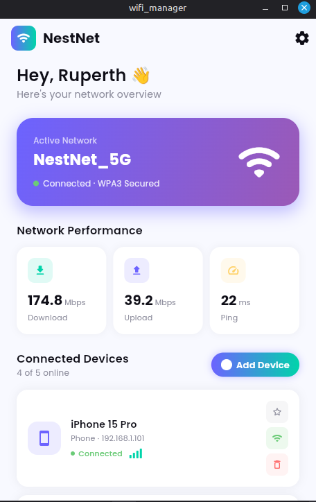
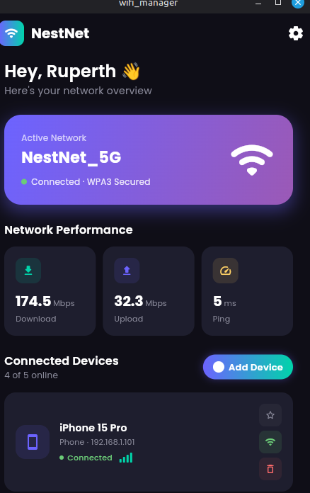
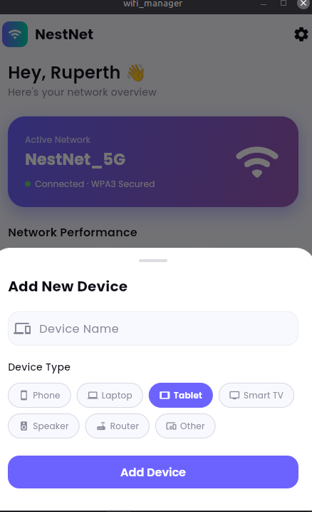
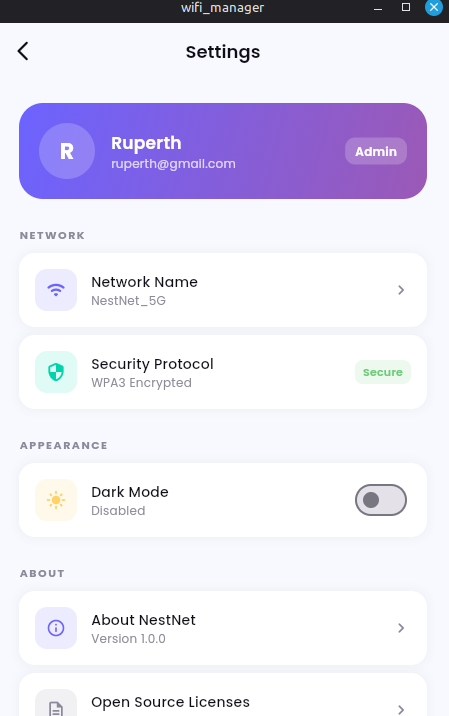

# WiFi Manager
---

## Screenshots

| # | Screen | Description |
|---|--------|-------------|
| 1 |  | Animated splash screen with elastic logo pop and pulse |
| 2 |  | Login screen with email/password and inline error banner |
| 3 |  | Account creation with full-name, email, and password confirmation |
| 4 |  | Home dashboard in light mode — live stats, network banner, device list |
| 5 |  | Home dashboard in dark mode with the same layout |
| 6 |  | Bottom sheet for adding a new device with type chip selector |
| 7 |  | Settings screen — profile card, network name editor, dark mode toggle |
---

## Features

- **Live Network Stats** — Download, upload, and ping update every 3 seconds via a broadcast stream
- **Device Management** — Add, remove, and toggle connection state for any device
- **Favorite Devices** — Star any device to pin it to the top of the list; favorites persist across restarts
*(new)*
- **Persistent Device List** — All devices are saved to `SharedPreferences` as JSON and restored on launch *(new)*
- **Persistent Network Name** — The custom network name survives app restarts *(new)*
- **Dark / Light Mode** — Theme preference is saved via `SharedPreferences`
- **Smooth Animations** — Elastic splash, slide-fade login, bouncing sign-up route, and `AnimatedContainer` on device cards
- **Signal Bars Widget** — Visual 4-bar signal strength indicator per device

---

## Tech Stack

| Layer | Package |
|-------|---------|
| Framework | Flutter (Dart) |
| State Management | `flutter_riverpod` |
| Fonts | `google_fonts` (Poppins) |
| Persistence | `shared_preferences` |
| Icons | Material Icons + `cupertino_icons` |

---

## Getting Started

```bash
# 1. Clone the repo
git clone https://github.com/ruperthjr/wifi_manager.git
cd nestnet

# 2. Install dependencies
flutter pub get

# 3. Run on a device or emulator
flutter run
```

Minimum Flutter SDK: **3.10.0**

---

## Project Structure

```
lib/
├── app.dart                  # Root MaterialApp with theme wiring
├── main.dart                 # Entry point — ProviderScope
├── core/
│   ├── constants.dart        # AppColors, AppStrings, AppDim
│   └── theme.dart            # Light and dark ThemeData
├── models/
│   ├── device.dart           # Device model with JSON serialization + isFavorited
│   └── user.dart             # AppUser model with initials helper
├── providers/
│   ├── auth_provider.dart    # Login, signup, logout state
│   ├── devices_provider.dart # Device list with SharedPreferences persistence
│   ├── network_provider.dart # Live stats stream + persistent network name
│   └── theme_provider.dart   # Dark mode toggle with SharedPreferences
├── Screens/
│   ├── SplashScreen.dart
│   ├── Login.dart
│   ├── SignUp.dart
│   ├── DashBoard.dart
│   └── Setting.dart
└── Widgets/
    ├── DeviceCard.dart       # Device row with favorite, toggle, remove actions
    ├── StatCard.dart         # Stat tile (download / upload / ping)
    ├── FadeRoute.dart        # Fade page transition
    ├── BouncingRoute.dart    # Elastic scale + fade page transition
    ├── Aboutme.dart          # About dialog
    └── LicenseWidget.dart    # Open-source licenses dialog
```

---

## Local Storage Keys

| Key | Provider | Type |
|-----|----------|------|
| `nestnet_dark_mode` | `themeProvider` | `bool` |
| `nestnet_devices` | `devicesProvider` | `JSON String` |
| `nestnet_network_name` | `networkNameProvider` | `String` |

---

## License

MIT — see [LICENSE](./LICENSE)
